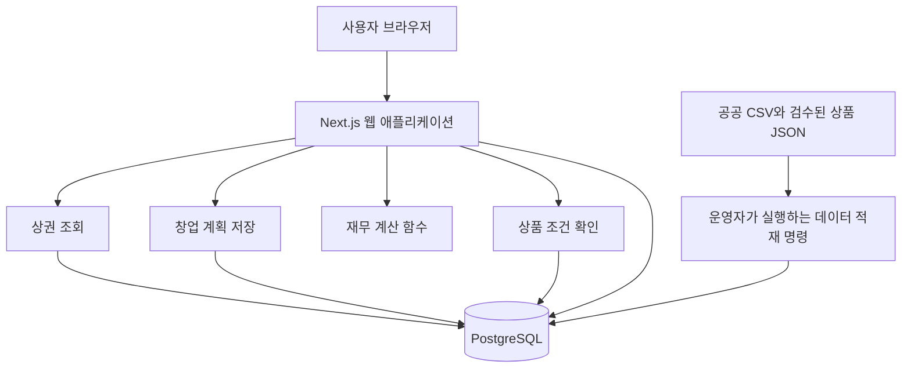

# TrendBench 예비 창업자 MVP — 기술 구조와 구현 방향

작성일: 2026-09-09

상태: 신규 MVP 구현 기준. 2026-09-18 저장소 개편 반영.

현재 범위와 우선순위는 [PRODUCT.md](PRODUCT.md), 작업 상태는 [TASKS.md](TASKS.md), 실행 방법은 [DEVELOPMENT.md](DEVELOPMENT.md)를 따른다. 이 문서의 코드 폴더 예시는 저장소의 `app/` 아래를 기준으로 한다. 기존 구현과 문서는 `legacy/`에 보존한다. 초기 연결 업종은 한식·커피 2개로 시작하며 3~5개 확장은 데이터 품질 확인 후 진행한다.

## 1. 설계 전제와 결론

이 설계는 이전 프로젝트의 코드, 데이터베이스, 기술 스택, 기존 백로그를 재사용 조건으로 삼지 않는다. 최근 합의한 예비 창업자 흐름을 출발점으로 하며, 창업 이후 POS 연동과 실제 매출 수집은 범위에서 제외한다.

제품의 목적은 **예비 창업자가 상권의 관측 지표를 참고하고, 자신의 매출·비용 가정으로 창업 필요자금과 상환 부담을 계산하며, 검토할 수 있는 정책자금 정보를 확인하는 것**이다.

권장 구현은 **Next.js + TypeScript 단일 애플리케이션, PostgreSQL 단일 데이터베이스, 검수한 공공데이터·상품 자료, 결정적 계산 함수**다. 처음부터 예측 모델이나 자동 금융추천 플랫폼을 구축하지 않아도 핵심 사용자 흐름을 완성할 수 있다.

기술 선택의 기준은 배포 단위, 외부 의존성, 데이터 기준과 계산 로직의 수를 줄이는 것이다. 팀의 기술 숙련도는 확인되지 않았으므로 아래 스택은 신규 개발 시의 기본 권장안이며 일정 확약의 근거는 아니다.

## 2. 사용자 흐름을 다시 검토한 결과

| 기존 개선안의 항목 | 구현·사용상 남는 문제 | 이번 설계의 결정 |
|---|---|---|
| 주소 자동 상권 매핑 | 주소 검색, 좌표 변환, 경계 버전, 다중 포함·경계 밖 처리 필요 | 첫 버전은 자치구 → 상권 직접 선택. 상세 주소는 선택 메모로 보관 |
| 0~100 상권 안정성 | 점수 산식·비교집단·검증 근거가 없으면 숫자의 의미를 설명하기 어려움 | 첫 버전은 매출 추이·점포·개폐업 지표와 근거 문장. 종합 안정성 점수 보류 |
| 주요 고객층·수요 | 인구·시설 등 추가 데이터 결합으로 범위 확대 | 선택한 매출 데이터에 있는 시간대·고객 구성만 품질 확인 후 부가 표시. 별도 인구 수집 보류 |
| 초기 필요자금 | 비용과 보유 현금, 대출 실행 전후를 혼동하기 쉬움 | 초기 지출, 목표 운영예비금, 자기자금, 가정한 조달액을 분리 |
| 손익분기점 | 운영비를 맞추는 매출과 부채까지 갚는 매출이 다름 | 운영비 충당 매출과 상환까지 포함한 현금수지 균형 매출을 별도 표시 |
| 월 영업현금흐름 | 예상 매출만으로 세금·재고·외상 회수까지 정확히 알 수 없음 | 결과 명칭을 '가정에 따른 월 운영수지·잔여현금'으로 명확히 한정 |
| 정책자금 추천 | 예비 창업자가 모든 상품의 신청 대상은 아니며 지원 시기도 다름 | 현재 검토 가능·추가 확인·등록 이후 검토·종료를 구분. 후보 0개도 정상 결과 |
| 상품 선택 후 계산 | 보증·지원금·대출은 현금과 상환에 미치는 역할이 다름 | 자동 상환 계산은 지원하는 대출 구조에 한정. 다른 유형은 정보와 조건 확인 중심 |
| 조건 미확정 대출 | 범위 금리·변동금리 등을 확정값처럼 계산할 위험 | 사용자 확인을 받은 가정 조건으로만 시뮬레이션하고 상품의 확정 조건과 구분 |
| 가정 수정과 결과 저장 | 자동 재계산·부분 갱신이 복잡한 상태 관리를 만듦 | 초안 저장 + '다시 계산' 버튼 + 불변 결과 저장. 종속 그래프·이벤트 처리 도입 안 함 |
| 모든 입력을 끝까지 강제 | 모르는 값 때문에 탐색 자체가 중단됨 | 모르는 값은 null. 부분 결과와 누락 목록을 반환하고 0으로 대체하지 않음 |

주소 자동 매핑과 종합 점수 보류는 실제 UX 범위 변경이다. 주소를 입력하면 자동으로 정확한 상권을 찾거나 상권의 안전성을 판정해 준다고 소개해서는 안 된다.

## 3. 구현할 MVP 범위

### 첫 출시 범위

- 대상: 예비 창업자.
- 지역: 서울의 데이터가 검증된 상권. 업종은 음식점·카페 등 실제 공공 코드에 맞춰 3~5개부터 지원한다.
- 관측 기간: 선택한 데이터에서 확보되는 최근 8~12개 비교 가능한 완결 분기를 우선한다.
- 핵심 화면: 상권 탐색, 창업 계획, 자금 후보, 시뮬레이션·결과, 저장 계획 목록.
- 계획 입력: 초기 지출·예비금·자기자금, 월매출 가정, 월 고정비·변동비, 선택 대출 조건.
- 결과: 부족자금, 운영비 충당 매출, 상환 포함 균형 매출, 월 상환 일정, 3개 시나리오, 간이 월별 현금 잔액.
- 자금 정보: 검수 가능한 실제 공고 5~10개를 목표로 시작한다. 개수를 맞추려고 관련 없는 상품이나 종료된 상품을 신청 가능 목록에 넣지 않는다.
- 비교: 한 계획의 가정을 바꿔 새 결과로 저장하고, 저장 결과 2개를 표로 비교한다.

### 첫 버전에서 보류할 기능

POS·Toss·매출파일 업로드, 실제 사업 실적 분석, 폐업·생존 예측 ML, 종합 신용·안정성 점수, 자동 공고 해석 LLM, 금융상품 최적화 순위, 여러 상품의 동시 조달 최적화, GIS·지도·반경 검색, 전국 업종 매핑, 자동 PDF 보고서, 관리자 대시보드, 메시지 큐·Redis·별도 분석 DB·데이터 오케스트레이터는 구현하지 않는다.

이는 핵심 흐름을 검증하기 위한 범위 결정이다. 보류한 기능을 필요 이상으로 인터페이스나 빈 모듈로 미리 만들어 두지 않는다.

## 4. 실제 화면 흐름과 입력·출력

| 단계 | 입력 | 출력 | 다음 행동 |
|---|---|---|---|
| 1. 상권 탐색 | 자치구·상권·지원 업종 | 최신 비교 가능 분기, 매출·점포·개폐업 추이, 데이터 제한 | 후보지를 유지하거나 변경 |
| 2. 창업 계획 | 초기 지출, 예비금, 자기자금, 매출 가정, 월 비용, 창업 시기·용도 | 부족자금, 월 운영수지, 운영비 충당 매출, 누락 정보 | 가정 수정 또는 자금 탐색 |
| 3. 자금 후보 | 기존 정보 자동 사용, 공고별 필요한 추가 확인 | 후보와 명확한 미충족·미확인 사유, 공식 링크 | 한 상품 또는 가정 대출 선택; 무차입 선택 가능 |
| 4. 시뮬레이션 | 선택 금액, 확인된/가정한 금리·기간, 기존 월 부담, 시나리오 | 월 상환액, 상환 후 잔여현금, 개업 시 자금 충족, 3개 시나리오 | 조건 수정·재계산 |
| 5. 저장·비교 | 계획 이름, 비교 대상 결과 | 가정과 버전이 고정된 결과, 변경 전후 비교 | 계획 보완 |

상권 탐색은 공개로 제공하고, 개인 계획 작성·서버 저장을 시작할 때 로그인한다. 익명 초안을 나중에 계정으로 병합하는 기능은 첫 버전에서 만들지 않는다. 탐색 중 선택한 상권·업종은 로그인 후 이어받는다.

계획은 단계별 '저장하고 다음'과 명시적 '초안 저장'으로 보존한다. 저장되지 않은 입력이 있을 때 이탈 경고를 표시한다. 매 키 입력마다 서버 저장하는 기능은 불필요하다.

### 막히는 상황의 처리

- 상권 자료가 없는 경우: 상권 결과에 '자료 부족'을 표시하고 재무 계획은 계속 작성 가능.
- 매출을 모르는 경우: 고객 수·객단가·영업일 계산 도우미 제공. 모두 모르면 비용·부족자금만 산출.
- 자금 후보가 없는 경우: 이유를 보여주고 사용자가 명시한 가정 대출 또는 무차입으로 검토 계속.
- 대출 조건이 불명확한 경우: 해당 상품의 상환액은 미산출. 별도의 가정 조건 입력을 선택할 수 있음.
- 개업 전에 필요한 지출을 충당하지 못하는 경우: '초기 자금 미충족'으로 표시. 긍정적인 월 수지만으로 실행 가능한 계획처럼 표시하지 않음.

## 5. 권장 기술 구조



네 개의 모듈은 같은 애플리케이션 내부의 코드 폴더다. 각각 별도 서버로 배포하지 않는다. 계산 함수 자체는 DB·외부 API 없이 입력 객체를 받아 결과 객체를 반환한다.

| 항목 | 권장 선택 | 목적 |
|---|---|---|
| 화면·서버 | Next.js App Router + TypeScript | 화면과 API를 한 프로젝트·한 배포로 제공 |
| 저장소 | PostgreSQL | 사용자 계획, 결과, 상권 집계, 상품 조건을 함께 관리 |
| DB 접근·migration | Prisma | 스키마와 순서가 있는 변경 파일 관리 |
| 인증 | Better Auth의 이메일·비밀번호 및 DB 세션 | 인증 로직·JWT를 직접 구현하지 않음 |
| 입력 검증 | Zod | 서버의 런타임 스키마 검증; 화면에서도 같은 규칙 재사용 |
| 계산 | TypeScript 순수 함수 + decimal 연산 라이브러리 | 원 단위 금액·이자·반올림 일관성 |
| 그래프 | 단일 React 차트 라이브러리 | 매출 추이와 3개 시나리오 시각화; 표 대안 제공 |
| 테스트 | Vitest + 소수의 Playwright 시나리오 | 계산·조건 판정 검증과 사용자 전체 흐름 확인 |
| 실행 | Node.js 애플리케이션 1개 + PostgreSQL 1개 | 초기 운영 구성 최소화 |

Next.js는 Route Handler로 서버 API를 제공하며 Node.js 또는 Docker 배포를 지원한다. 이 기능을 활용해 별도 API 서버를 두지 않는 설계를 제안한다. [Route Handlers](https://nextjs.org/docs/app/getting-started/route-handlers), [배포 안내](https://nextjs.org/docs/app/getting-started/deploying).

Better Auth는 이메일·비밀번호와 PostgreSQL 연동을 제공한다. 도입 시 Next.js·ORM·인증 라이브러리의 호환 버전을 작은 로그인 예제로 확인하고 lockfile에 고정한다. [인증 설치](https://better-auth.com/docs/installation), [PostgreSQL 연결](https://better-auth.com/docs/adapters/postgresql).

### 코드 폴더 예시

```text
src/
  app/                 화면 및 얇은 API route handler
  features/
    market/            상권 조회·지표 해석
    plans/             계획 입력·저장·결과 버전
    finance/           재무·대출·시나리오 계산 함수
    funding/           고정된 조건 판정 함수
  components/          폼·표·차트
  lib/                 DB·인증·공통 오류
prisma/                스키마·migration
scripts/               상권·상품 검증 및 적재 명령
catalog/               검수된 상품 JSON
tests/                 계산·API·종단 테스트
```

도메인마다 형식적인 controller/service/repository/interface 계층을 반복하지 않는다. API 경계, 순수 계산, DB 접근 정도만 분리한다. 화면 입력 상태는 React와 서버 응답으로 관리하고 전역 상태관리 라이브러리는 도입하지 않는다.

## 6. 외부 데이터의 현실성과 수집 방식

### 6.1 공공 상권 데이터

서울시 추정매출 데이터셋은 분기 갱신과 CSV 제공을 안내한다. 또한 2026-07-03 적용 공지에는 공간 단위 변경과 2021년 이후 자료 제공 기준이 명시되어 있다. 과거 파일을 모았다는 이유만으로 일관된 시계열이라고 가정할 수 없다. [서울시 추정매출-상권](https://data.seoul.go.kr/dataList/OA-15572/S/1/datasetView.do).

서비스 소개에는 분기 종료 뒤 갱신 시차와 CSV·API 등의 제공 방식이 안내되어 있다. 따라서 사용자가 화면을 열 때마다 원천 API를 실시간 호출할 필요는 낮다는 것이 이번 설계의 판단이다. [서울시 데이터 제공 안내](https://golmok.seoul.go.kr/introduce.do).

**최소 데이터 묶음:** 상권 코드·명칭·자치구, 업종 코드, 분기별 추정매출, 점포·개폐업. 상권 인구·시설·개별 경쟁점포 API를 동시에 붙이지 않는다.

적재 절차:

1. 운영자가 공식 파일과 설명서를 확보한다.
2. 원본 파일·출처 URL·기준기간·입수일·checksum을 보존한다.
3. 적재 명령이 인코딩, 헤더, 단위, 코드, 결측, 중복을 검사한다.
4. 하나의 데이터 릴리스로 임시 적재 후 검증한다.
5. 검증이 통과한 릴리스만 트랜잭션으로 활성화한다. 실패 시 이전 릴리스를 유지한다.

각 분기의 매출값이 분기 합계인지 월평균인지 실제 명세와 샘플로 확인하기 전에는 월 환산하지 않는다. 점포당 매출은 분모가 해당 매출의 점포 모집단과 일치하는지 확인한 경우에만 제공한다. 단순히 두 파일에 '점포 수'가 있다는 이유로 나누지 않는다.

동일 코드라도 공간 기준이 바뀌었다면 직접 비교 가능 여부를 확인한다. 비교가 불가능하면 과거 추이 연결을 중단하고 제한을 표시한다. 서로 다른 상권·상권배후지·행정동 통계를 같은 단위처럼 결합하지 않는다.

후속 실물 검증(2026-09-10 완료)에서 2024~2025년 매출 172,911행, 점포 611,664행과 영역 속성 1,650행을 읽었다. 모든 매출 행이 점포·상권 코드와 결합됐다. 점포 파일의 연도별 한글·영문 헤더 차이와 매출 미제공 조합을 확인했으므로 명시적 열 매핑 및 자료 부족 처리가 필요하다. 매출 시간 단위와 점포당 매출의 모집단은 아직 확정하지 않았다. 상세 근거와 재현 자료는 [실제 데이터·API 검증](13_Data_API_Feasibility_Verification.md)을 따른다.

### 6.2 정책자금 자료

기업마당의 API는 공고명·신청기간·지원대상·본문·첨부파일·공식 링크 등을 제공한다. API 응답만으로 복잡한 대출 조건을 계산 가능한 스키마로 완전히 확보할 수 있다고 가정하지 않는다. [기업마당 API 명세](https://www.bizinfo.go.kr/apiDetail.do?id=bizinfoApi).

첫 버전은 사람이 확인한 원 공고를 JSON으로 정리하고 검증 명령으로 적재한다. 일반 사용자 화면이 외부 공고를 직접 수집하지 않는다. 기업마당 자동 수집과 공고문 자동 추출은 후속 기능이다.

정책자금에는 사업단계와 대상 요건이 있다. 예를 들어 확인한 초기창업패키지 공고는 일정 업력 이내의 창업기업 대표자를 대상으로 명시한다. 모든 '창업' 공고가 아직 사업을 시작하지 않은 사용자에게 적용되는 것은 아니다. 이는 범용 추천을 약속하기 전에 상품 표본을 확인해야 하는 이유다. [2026년 초기창업패키지 공고](https://bizinfo.go.kr/sii/siia/selectSIIA200Detail.do?pblancId=PBLN_000000000117819).

상품의 reviewedAt, 신청기간, 접수 상태, 공식 URL을 보존한다. 기간은 매 조회 시 판단하고, '예산 소진 시' 같은 조건은 확인된 상태와 확인 시점을 표시한다. 다음 검토일이 지난 상품에는 재확인 필요 표시를 붙이며 자동으로 접수 중이라고 판단하지 않는다.

## 7. 상권 결과는 어떻게 계산하는가

첫 버전에서는 예측 모델을 사용하지 않는다.

- 최신 비교 가능 분기의 추정매출과 최근 추이.
- 가능하면 전년 동분기 대비 변화율. 비교값이 없거나 0이면 변화율 대신 '비교 불가'.
- 같은 공간·업종 기준의 점포 수와 개업·폐업 현황.
- 원천의 정의가 확인된 개폐업률. 정의되지 않은 분모를 새로 추정하지 않음.
- 코드·단위·기준기간·결측 상태를 함께 제공.

설명 문장은 규칙 템플릿으로 만든다. 예: '비교 가능한 전년 동분기보다 추정매출이 감소했습니다.' 매출 감소와 점포 증가가 함께 관측되면 각각의 사실을 제시하되 '과밀 때문에 매출이 감소했다'고 인과를 단정하지 않는다.

업종 내 percentile이나 가중 종합점수도 첫 출시 필수가 아니다. 관측 지표를 검증한 뒤 사용자가 실제로 비교에 어려움을 겪는지 확인하고 도입한다.

이 상권 결과가 사용자의 월매출을 자동으로 채우거나, 대출 자격 판정·상환 여력의 근거 점수로 직접 사용되지는 않는다.

## 8. 재무 계산의 정확한 범위

### 8.1 입력 구분

| 기호 | 의미 |
|---|---|
| I | 개업 전에 지출할 보증금·시설비·초기 재고·기타 준비비의 합계 |
| B | 목표로 확보할 개업 후 운영예비금 |
| E | 사업에 투입할 자기자금 |
| L | 사용자가 이번 시나리오에서 조달한다고 가정한 신규 대출금 |
| R | 사용자가 가정한 월매출 |
| F | 월 고정비 |
| v | 매출 대비 변동비율, 0 이상 1 미만 |
| D | 사업 현금에서 부담할 기존 월 상환액 |
| A_t | 신규 대출의 t개월 상환액 |

화면은 원·개월 단위를 명시한다. 기본 비용 입력은 임대료·인건비·기타 고정비와 재료비·매출연동 수수료율이다. 같은 비용을 월 고정액과 변동비율 양쪽에 입력하지 않도록 한다.

변동비를 금액으로 입력받는 도우미를 제공한다면 기준 매출에서 비율로 환산했다는 사실을 명시하고 그 기준을 저장한다. 기본 매출이 바뀌었다고 저장된 비율을 조용히 변경하지 않는다.

매출 입력 모드는 직접 월매출 또는 고객 수 × 객단가 × 영업일 중 하나다. 두 방식의 값을 동시에 계산의 기준으로 사용하지 않는다.

### 8.2 핵심 식

```text
목표 초기 필요자금 = I + B
계획상 부족자금 = max(I + B - E, 0)

가정한 조달 이후 개업 직전 현금 C0 = E + L - I
목표 예비금 미달액 = max(B - C0, 0)

월 운영수지 = R × (1 - v) - F
운영비 충당 매출 = F / (1 - v)

t개월 상환 후 잔여현금 = R × (1 - v) - F - D - A_t
t개월 상환 포함 균형 매출 = (F + D + A_t) / (1 - v)
Ct = C(t-1) + t개월 상환 후 잔여현금
```

부족자금이 계산되었다고 L에 같은 금액을 확정 자금으로 자동 반영하지 않는다. 무차입이면 L=0이며, 사용자가 가정 대출을 선택한 경우에만 해당 시나리오의 L로 반영한다.

C0가 음수이면 초기 지출 자체가 미충족이다. C0는 0 이상이지만 B보다 작다면 목표 예비금 부족이다. 두 상황은 구분한다. 정책자금의 예상 선정·지원금은 확보된 자기자금으로 자동 합산하지 않는다.

월별 잔액은 기본 12개월 간이 예산으로 제공한다. 음수로 처음 전환되는 달을 보여주되 매출 예측에 따른 실제 생존기간처럼 표현하지 않는다. 초기 재고를 구매한 경우 월 변동비는 개업 후 재구매·사용에 대한 단순 가정임을 표시한다. 정교한 재고·외상·세금 회계는 계산 범위에 포함하지 않는다.

### 8.3 대출 계산

첫 계산 엔진은 고정된 연 금리 가정, 월 상환, 원리금균등·원금균등, 선택적 원금 거치기간을 지원한다. 거치기간은 이자만 지급하고 총 기간에 포함하는 것으로 정의한다.

원리금균등 예:

```text
r = 연 금리 / 12
n = 총 상환개월
g = 원금 거치개월, 0 <= g < n
m = n - g

거치기간 월 상환액 = L × r
거치 종료 후 월 상환액 = L × r / (1 - (1 + r)^(-m))
r = 0이면 거치 종료 후 월 상환액 = L / m
```

원금균등은 남은 m개월에 원금을 나누고 잔액에 이자를 계산한다. 두 방식 모두 일정표의 마지막 원금 잔액을 보정한다. 결과는 첫 달·거치 종료 직후·최대 월 부담과 전체 일정을 제공한다.

변동금리 재설정, 일수별 이자, 만기 일시상환, 복잡한 이자지원·보증료 등은 첫 자동 계산에서 제외한다. 해당 상품은 정보 조회가 가능하지만 '지원하는 가정 계산'과 '상품 실제 조건 계산'을 구분한다. 반영되지 않은 비용을 0으로 조용히 처리하지 않고 계산 포함 범위를 표시한다.

### 8.4 시나리오

기본값은 사용자가 입력한 계획이다. 악화·개선은 서비스가 제공하는 **스트레스 가정 템플릿**을 확인한 뒤 적용한다. 템플릿 수치는 실증적 예측이나 발생확률로 설명하지 않는다.

각 시나리오는 매출, 고정비, 변동비율 중 무엇을 바꾸는지 표시한다. 비율 변화는 퍼센트와 퍼센트포인트를 구분한다. 대출 금리의 별도 민감도는 사용자 선택으로만 반영한다.

계산하지 못하는 항목은 0이나 정상 상태로 바꾸지 않는다. 예를 들어 매출 미입력이어도 I·B·E가 있으면 부족자금은 계산할 수 있다.

### 8.5 수치 검산용 예시

다음은 실제 상품 추천이나 예상 매출이 아닌 계산 예제다. 금액은 단순 현금예산이며 세금·수수료 등은 별도다.

초기 지출 8천만 원, 예비금 1천만 원, 자기자금 4천만 원이면 목표 부족자금은 5천만 원이다. 5천만 원을 조달한다고 가정하면 개업 직전 현금은 1천만 원이다.

| 항목 | 예제 값 |
|---|---:|
| 월매출 | 20,000,000원 |
| 고정비 | 7,000,000원 |
| 변동비율 | 35% |
| 대출 가정 | 50,000,000원, 연 5%, 60개월, 거치 없음, 원리금균등 |
| 기존 상환액 | 0원 |
| 월 상환액 | 약 943,562원 |
| 운영비 충당 매출 | 약 10,769,231원 |
| 상환 포함 균형 매출 | 약 12,220,864원 |
| 기본 월 잔여현금 | 약 5,056,438원 |
| 악화 가정 | 매출 16,000,000원, 고정비 7,350,000원, 변동비율 40% |
| 악화 월 잔여현금 | 약 1,306,438원 |

이 예제는 단순 계산으로 검산했다. 구현 시에는 decimal 연산과 상환 일정 전체의 검증이 별도로 필요하다.

## 9. 상품 조건 판정은 고정된 규칙으로 제한

### 관리할 필드

productKey, version, 상품명, 기관, 자금유형, 지역, 지원 업종·제외 조건, 신청 가능한 사업단계, 용도, 신청기간, 공개 한도, 금리 조건, 상환 조건, 추가 확인사항, 공식 URL, reviewedAt, nextReviewAt, 검수자, 원 공고 checksum을 관리한다.

상품 기준 업종과 상권 업종 코드가 다른 경우 지원 업종 3~5개에 대한 수동 매핑만 검수한다. 모호한 경우 미확인으로 둔다. 전국 업종체계 자동 변환을 선행하지 않는다.

### 판정 방식

범용 규칙 언어나 임의 수식을 실행하는 엔진을 만들지 않는다. 고정된 필드 비교 함수를 사용한다.

각 조건은 `PASS / FAIL / UNKNOWN`으로 평가한다.

- 명확한 FAIL이 하나라도 있으면 현재 조건 미충족.
- FAIL은 없지만 UNKNOWN이 있으면 추가 확인.
- 지원하는 명시적 조건이 모두 PASS이면 검토 후보. 실제 승인이나 완전한 자격 확정의 의미는 아님.

접수 상태 `OPEN / CLOSED / UNKNOWN`은 위 자격 상태와 별도로 저장한다. 사업자등록 후에만 확인 가능한 상품은 '등록 이후 검토'로 구분하고 현재 이용 가능 후보와 섞지 않는다. 창업 예정 시기에 실제 공고가 열릴 것이라고 추정하지 않는다.

표시는 상태별 그룹과 공개 한도·기간 중심으로 정렬한다. 숨겨진 가중치로 '최적 상품' 순위를 만들지 않는다. 희망 금액이 공개 한도보다 크다는 사실은 사업자의 자격 미충족과 구분한다. 한도 차이와 남는 부족자금을 보여주고 사용자가 시뮬레이션 금액을 조정하게 하며, 다른 상품 조합으로 자동 해결하지 않는다. 공고 자체에 최소 신청금액 등 명시적 자격 조건이 있으면 해당 조건은 별도로 판정한다.

### 운영 방식

5~10개 검수 상품은 저장소의 JSON으로 관리하고 schema 검증·차이 확인·적재 명령으로 새 버전을 추가한다. 원본 공고는 URL과 checksum 및 필요한 설명 근거를 보존한다. 파일 변경이 곧바로 사용자 추천에 활성화되지 않도록 검수 필드와 명시적 활성화 절차를 둔다.

관리자 UI, 검토 큐, 자동 공고 수집 서버는 첫 버전에서 필요하지 않다. 한 명의 운영자가 검수하고 적재하는 역할만 명확히 정한다. 실제 검수 담당자가 없다면 자금 정보의 지속 운영은 준비되지 않은 상태다.

## 10. 데이터베이스는 업무 테이블 7개로 시작

인증 라이브러리의 사용자·계정·세션 관련 테이블은 별도다. 라이브러리 내부 스키마를 재설계하지 않는다.

| 테이블 | 책임과 핵심 필드 |
|---|---|
| `plans` | 사용자 소유의 수정 가능한 초안. user_id, title, area_release_id, area_code, industry_code, input_json, schema_version, revision |
| `plan_results` | 불변 계산 결과. plan_id, input_revision, input_snapshot, result_json, calculation_version, market_release_id, catalog_hash, evaluation_date, calculation_key, calculated_at |
| `market_releases` | 데이터 묶음의 출처·기간·공간/정의 버전·파일 checksum·활성 상태 |
| `market_areas` | release_id + area_code, 상권명·자치구. 공간 경계 도형은 저장하지 않음 |
| `industries` | 지원 업종 코드·명칭·원천 분류 버전 |
| `market_quarterly` | release_id + quarter + area_code + industry_code별 관측 지표 |
| `funding_product_versions` | product_key + version, 구조화 조건 JSON, 근거·검수·접수 정보 |

검색·권한·결합에 필요한 값은 일반 컬럼에 둔다. 변화가 잦고 계획 단위로 함께 읽는 입력과 결과는 JSONB를 사용하되 서버 schema로 검증한다. PostgreSQL은 JSONB 저장과 조회를 지원하고 Prisma는 PostgreSQL의 JSON·Decimal 타입을 매핑한다. [PostgreSQL JSON 타입](https://www.postgresql.org/docs/current/datatype-json.html), [Prisma PostgreSQL 매핑](https://docs.prisma.io/docs/orm/core-concepts/supported-databases/postgresql).

상품을 수정할 때 기존 버전을 덮어쓰지 않는다. 과거 결과에는 사용한 상품 버전뿐 아니라 판정 근거·적용 금리 가정·출처 기준일도 저장한다. 상권 결과 또한 당시 지표를 result_json에 보존한다.

데이터 릴리스를 바꾸어도 기존 결과는 유지한다. 예전 릴리스의 상권코드를 새 릴리스에 자동 연결하지 않고 코드의 유효성을 확인한다. 다시 계산할 때 상권을 찾을 수 없으면 재선택을 요구한다.

예를 들어 1,500개 상권 × 5개 업종 × 12분기라면 지표 행은 9만 개다. 이는 용량 산정을 위한 가정이며 실제 상권 수를 측정한 값이 아니다. 이 정도의 집계 중심 조회를 출발점으로 PostgreSQL에서 먼저 측정하고, 병목이 입증될 때 저장 구조를 확장한다.

금액은 원 단위 정수 문자열로 API에 전달하고 서버에서는 decimal로 연산한다. DB 고정 금액은 NUMERIC(18,0), 계산 중 비율·이자는 충분한 소수 정밀도를 사용한다. JSON에도 큰 금액은 문자열로 보존해 JavaScript number의 정밀도 손실을 방지한다. 화면은 서버가 확정한 원 단위 반올림 값을 사용한다.

## 11. API와 결과 상태

인증 API를 제외한 최소 업무 API 제안:

```http
GET    /api/markets/areas?districtCode=...
GET    /api/industries
GET    /api/markets/summary?areaCode=...&industryCode=...

POST   /api/plans
GET    /api/plans
GET    /api/plans/{id}
PUT    /api/plans/{id}
DELETE /api/plans/{id}

POST   /api/plans/{id}/funding-matches
POST   /api/plans/{id}/calculations
GET    /api/plans/{id}/results
GET    /api/plans/{id}/results/{resultId}
```

하나의 계산 응답은 자금 계획, 운영수지, 상환 일정, 시나리오, 입력 부족 정보를 함께 반환한다. 상품 판정은 현재 초안에서 별도로 미리 볼 수 있다. 계산 요청이 선택한 상품 버전을 검증하고 결과에 고정한다.

시나리오마다 API를 따로 만들지 않는다. 부분 입력이 허용되므로 계산 결과는 항목별 `READY / INSUFFICIENT_INPUT / UNSUPPORTED`와 missingFields를 제공한다. 유효하지 않은 입력은 계산하지 않고 필드 오류로 반환한다.

초안 수정은 revision을 보내고 조건부 갱신한다. 다른 탭에서 먼저 수정했다면 409로 알려준다. 중복 클릭 방지와 함께 `plan + input revision + 계산규칙 버전 + 데이터 릴리스 + 상품 카탈로그 버전 + 판정 기준일 + 조건 가정`의 키를 만들고 UNIQUE 제약으로 동일 계산 결과의 중복 저장을 막는다.

판정 기준일은 서버의 한국 시간 날짜로 고정해 저장한다. 공고문이 수정되지 않았어도 다음 날 접수가 끝날 수 있으므로 카탈로그 버전만으로 현재 판정을 재사용하지 않는다. 시각까지 정해진 마감은 해당 한국 시간과 판정 당시 접수 상태도 계산 키에 반영한다. 화면은 과거 판정 시점과 현재 공고 상태를 구분한다.

클라이언트는 저장된 결과의 input_revision과 초안 revision이 다르면 '입력이 변경되었습니다. 다시 계산하세요'를 표시한다. 오래된 결과를 최신 초안의 결과처럼 보여주지 않는다.

계산은 소규모 동기 요청으로 처리한다. 요청 중 외부 API를 호출하지 않고, 데이터 수집도 수행하지 않는다. 초안 변경 시 화면이 몇 개 영향을 받는지 추적하는 복잡한 부분 재계산 엔진은 필요하지 않다.

## 12. 배포·보안·운영 최소선

- 운영 배포 단위는 웹/서버 애플리케이션과 PostgreSQL 두 개다. 장기 데이터 적재는 같은 코드베이스의 별도 실행 명령으로 처리한다.
- 사용자 데이터 조회·수정·삭제·계산은 매번 서버에서 session.userId와 plan.user_id를 확인한다. UUID와 화면 보호만으로 권한 검사를 대체하지 않는다.
- 인증·세션·비밀번호는 인증 라이브러리에 맡기고, 쿠키·CSRF·요청 제한 등 라이브러리 통합을 실제 환경에서 확인한다.
- DB 자격정보와 인증 secret은 서버 환경변수로 관리한다. 계획의 상세 금액과 민감한 신청 조건을 기본 로그에 기록하지 않는다.
- 저장 자료는 최소화한다. 주민등록번호·신용정보·증빙파일 업로드는 받지 않는다. 상품별로 확인이 필요한 조건만 최소한으로 질문한다.
- DB 백업과 복원 절차, 서버 오류 로그, 데이터 릴리스·상품 검수일 확인으로 시작한다. 별도 관측 플랫폼과 관리자 앱을 선행하지 않는다.
- 외부 공공데이터가 갱신되지 않으면 기존 데이터와 기준일을 표시한다. 과거 결과를 덮어쓰지 않는다.
- 공개 출시 전에는 가입·비밀번호 복구에 필요한 이메일 전달과 운영 책임을 확인한다. 내부 데모는 준비된 테스트 계정으로 검증할 수 있지만 이것을 공개 운영 준비 완료로 보지는 않는다.

## 13. 구현 순서와 완료 조건

| 단계 | 만들 것 | 완료 조건 |
|---|---|---|
| 0. 자료·조건 검증 | 공공 파일 표본과 실제 상품 3~5개 검토 | 코드·분기·단위 결합 가능, 예비 창업자 적용 여부와 필요한 추가 조건 확인 |
| 1. 계산 핵심 | 자금·비용·손익분기·대출·3시나리오 순수 함수 | 경계값과 수기 검산 예제 통과 |
| 2. 계획 저장 | 인증, plans/results, 단순 입력·결과 화면 | 입력→초안 저장→계산→재접속 조회, 다른 사용자 접근 차단 |
| 3. 상권 연결 | 수동 선택, CSV 적재, 추이 표·차트 | 실제 자료 기반 근거·기준일·누락 처리; 데이터 중복 적재 없음 |
| 4. 자금 후보 | 상품 JSON 검수·적재, 고정 규칙, 선택 조건 계산 | 미확인·미충족·종료·등록 이후 상태와 후보 0개 처리 |
| 5. 전체 완성 | 저장 결과 2개 비교, 모바일, 빈 상태·오류 | 대표 흐름과 복구 경로 종단 검증, 배포·백업·운영 확인 |

초기 계산 화면에는 실제 공공데이터가 준비되지 않아도 사용자가 직접 입력한 가정으로 계산하는 정상 경로가 있어야 한다. 상권 샘플은 개발용이라고 표시한다. 전체 출시 시 실제 검증된 데이터와 검수 상품 연결이 필요하다.

작업 기간은 팀 인원·숙련도·자료 확보 상황을 확인하지 않았으므로 확약하지 않는다. 계획상 주요 불확실성은 화면 구현보다 공공 지표의 정의 일치와 정책자금 검수다. 0단계 결과로 범위를 고정한 뒤 일정 산정이 가능하다.

## 14. 반드시 검증할 시나리오

### 계산

- 매출 0·미입력, 변동비율 0·100%·초과, 음수 비용과 0개월.
- 대출 0·금리 0·거치 0·거치가 전체기간 이상.
- 원리금균등·원금균등에서 원금 합계와 최종 잔액, 거치 종료 시 부담 변화.
- 초기 지출 미충족과 예비금 미충족의 구분.
- 기본·악화·개선에서 바뀌는 값과 유지되는 값, 퍼센트포인트 처리.
- 원 단위 반올림 후 일정표·합계 일치, 큰 금액 전달·저장 정밀도.

### 데이터·상품

- 같은 공공 파일을 두 번 적재해도 중복 없음.
- 잘못된 코드·분기·단위·공간 기준으로 결합하지 않음.
- 공고 종료·미확인 접수 상태·검토일 경과를 현재 신청 가능으로 표시하지 않음.
- 한 조건 FAIL, 나머지 UNKNOWN이면 미충족; FAIL 없이 UNKNOWN이면 추가 확인.
- 등록 이후 가능한 상품과 현재 예비 창업자 대상 상품 구분.
- 지원되지 않는 상품 계산·금리 미확정을 0원 상환으로 표시하지 않음.

### 사용자 흐름

- 상권 정보만 확인하고 계획 작성으로 이동.
- 매출을 몰라도 초기 부족자금까지 계산.
- 자금 후보가 없어도 가정 시뮬레이션 완료.
- 대출이 필요 없는 사용자는 무차입 결과 확인.
- 초안 수정 후 예전 결과에 변경 안내 표시.
- 저장 결과는 새로운 상품·데이터 적재 후에도 그대로 유지.
- 다른 사용자 plan/result ID로 조회·수정·삭제·계산 불가.

## 15. 출시 판단과 확장 조건

첫 출시의 성공은 **한 예비 창업자가 지원하는 상권을 선택하고, 자신의 가정으로 창업비용·부족자금·운영수지를 이해하며, 후보가 있거나 없는 경우 모두 상환 부담 검토와 결과 저장을 마치는 것**이다.

모든 핵심 계산과 권한·데이터 부족·중복 처리 테스트가 통과하고, 실제 공공 지표와 상품 조건의 표본 검수가 완료되어야 한다. '설계 문서 확인'은 데이터 다운로드·실행 검증을 대신하지 않는다.

확장은 다음 증거가 생길 때 검토한다.

| 확장 | 도입 근거 |
|---|---|
| 주소 자동 매핑 | 사용자가 상권 선택에 반복적으로 실패하고 실제 경계 자료의 품질·API 조건이 확인됨 |
| 관리자 화면 | 상품 검수 인원이 늘거나 파일 기반 운영이 병목이 됨 |
| 자동 수집 | 수동 업데이트 누락이 관측되고 대상 원천의 규격이 안정됨 |
| 종합 상권 점수·ML | 지표·비교집단·목표 정의와 시간순 검증으로 유용성이 입증됨 |
| 캐시·추가 저장소 | 실제 부하 측정에서 단일 DB 조회가 병목임을 확인 |

POS와 창업 이후 실적 연동은 이 MVP의 확장 우선순위에 자동 포함하지 않는다.

## 16. 이번 검토에서 확인한 것과 남은 검증

확인: 최신 사용자 흐름의 논리, 공공데이터 제공 공지·갱신 단위, 기업마당 API 항목, 일부 실제 지원사업의 대상 조건, 권장 프레임워크·인증·DB 도구의 공식 지원 내용, 재무 예제 수치.

후속 확인: 2024~2025년 공공 CSV·영역 DBF 실물 결합, 키 중복·누락 검사, 지원사업 4건의 조건 표본 검토. [검증 보고서](13_Data_API_Feasibility_Verification.md)에 범위와 제약을 기록했다.

미수행: 기존 코드 재평가, 신규 앱 구현, 라이브러리 조합 실행, 인증키를 사용하는 외부 호출, 매출 환산 기준·모집단의 최종 확정, 상품 5~10개 전체 검수, 성능·보안·상환 엔진 테스트, 배포.

이번 문서는 위 한계를 반영한 구현 제안이다. 이전 문서의 POS·ClickHouse·예측 점수 요구를 자동 승계하지 않으며, 여기서 제안한 단순화 범위를 기준으로 새 구현을 시작할 수 있다.
